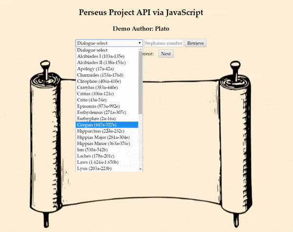

# perseus-project-api-javascript-integration
Allows users to request and view Greek texts by Plato stored in the Perseus database via modern JavaScript implementation (jQuery and AJAX). 

# tech
XML, jQuery, AJAX, HTML, CSS

# problem and solution
The Perseus Project API, a treasury of ancient Greek and Latin texts, only returns XML and only on non-secure servers, whereas modern web standards tend to call for JSON on secure servers. This web app solves the problem by allowing users to request and view Greek texts stored in the Perseus database via modern JavaScript implementation: AJAX calls retrieve the XML, which the app then converts to a streamlined JSON object easily readable by modern browsers.

# try it yourself!
http://plato.usite.pro/index.html

